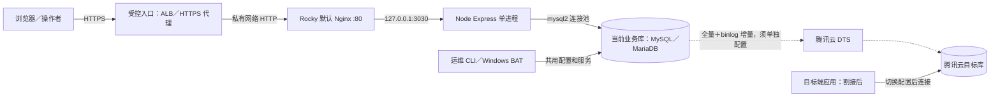
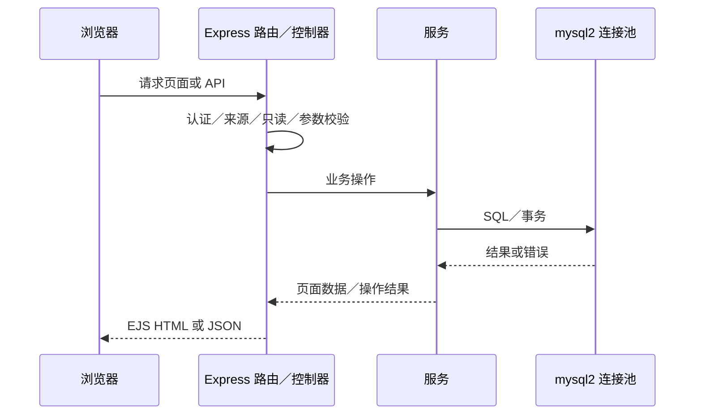
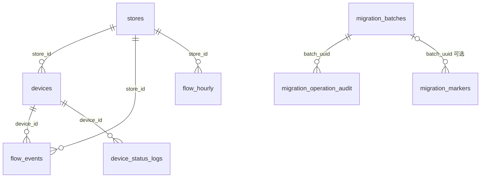

# 客流系统架构手册（现状 0.3.2）

> 编写日期：2026-09-23。供开发、运维和交接人员定位代码、理解数据流与部署边界。它描述仓库实现；实际云资源和 DTS 配置需以现场为准。功能口径参见[现状 PRD](产品需求说明书-现状版.md)。

## 1. 架构总览

系统是一个 Node.js 进程中的 Express 应用，使用 EJS 服务端页面、少量浏览器 JavaScript、`mysql2` 连接池和 MySQL/MariaDB 八张业务表。静态资源由项目本地供应；不依赖容器或外部队列。CLI 与网页复用部分服务和数据库配置。



图中的 ALB、DTS 和目标端应用并非安装脚本自动建好的资源；安装脚本会安装 Nginx 包，并将 `deploy/nginx/passenger-flow.conf` 加入 Rocky 默认站点，但不会启动未运行的 Nginx。Windows 本地可由浏览器直接访问 127.0.0.1:3030；Linux 运行目录默认为 `/opt/passenger-flow-codex`。Nginx 80 仅应用于可信私网／ALB 目标组，公网 TLS 在前置入口终止；Node 固定要求回环监听。AWS、Rocky 和 DTS 的真实连通与配置状态需另行核验。

## 2. 进程启动与请求链

### 2.1 启动链

```text
.env / ENV_FILE
  -> config/settings.js 解析 DB、时区、TLS、只读和启动参数
  -> scripts/db-ready.js 检查八张表；允许时调用 db-init 补表
  -> app.js 验证监听地址和 Basic Auth 配置
  -> Express 中间件 -> routes -> controllers -> services/models -> mysql2 pool
```

- `scripts/db-ready.js` 的 `AUTO_INIT_SCHEMA` 默认是 `true`。缺表且允许初始化时运行 `scripts/db-init.js`；它只补当前已存在数据库内的表，数据库和账号须提前创建；种子资料不会自动生成。DTS 目标端应显式设 `AUTO_INIT_SCHEMA=false` 并等待 DTS 建表。
- Windows `start-local.bat` 明确调用 `db:init` 和 `db:seed`，随后启动。Windows `start-configured.bat` 也**显式调用 `db:init`**，即使 `AUTO_INIT_SCHEMA=false` 也会尝试补表；目标端或只读账号应使用适合该场景的只读验证和启动流程，不能仅凭自动初始化开关判断 BAT 是否安全。
- Linux `deploy/install.sh` 准备运行目录、生产依赖、服务用户、systemd 单元和默认 Nginx 代理；只重载已运行的 Nginx，不启动未运行的服务，也不建库或生成数据。`deploy/verify.sh` 只读检查；systemd 的 `ExecStartPre` 执行 `db-ready.js`，主进程执行 `app.js`。
- 生产实例的数据库连接、端口、环境标签和认证由 `.env` 指定；`.env.example` 是模板。读取现有配置时不应公开密码。`PORT` 默认 3030，`BIND_HOST` 默认 127.0.0.1。

### 2.2 HTTP 请求链

`app.js` 按顺序挂载配置展示变量、`middleware/security.js`、JSON/Form 解析、静态文件、`middleware/maintenance.js`、`middleware/validation.js`、`routes/index.js` 和错误处理。安全中间件对除 `/health`、`/live` 外的请求执行单账号 Basic Auth；对写请求检查 Origin／浏览器站点来源。维护中间件阻断写请求，但允许负载停止接口。`config/database.js` 的写入包装层再检查只读状态，降低 CLI 或服务调用绕过 HTTP 中间件的可能。



## 3. 代码分层与主要入口

| 层 | 代码 | 职责与边界 |
|---|---|---|
| 应用与配置 | `app.js`、`config/settings.js`、`config/database.js` | 监听、配置解析、数据库连接池与事务上下文；`AsyncLocalStorage` 使事务内模型调用共用连接 |
| 中间件 | `middleware/*` | Basic Auth、跨站写入检查、只读保护、输入校验、错误转译；不提供角色级授权 |
| 路由与控制器 | `routes/*`、`controllers/*` | URL 到页面或 JSON 的映射，组织参数和响应 |
| 业务服务 | `services/*` | 看板聚合、基础资料批量扩容、客流实验、持续负载、容量缓存、快照比较、关联删除保护 |
| 数据模型 | `models/*` | SQL 查询与数据持久化；关系约束主要由服务层实现 |
| 页面和前端 | `views/*`、`public/js/*` | EJS 页面、Chart.js 图表、Migration Lab 与容量卡片轮询；不包含单页应用路由 |
| 运维入口 | `scripts/*`、根目录 BAT、`deploy/*` | 初始化、种子、造数、检查、维护、快照、比较、安装与启动 |

主要 URL：

| 地址 | 作用 | 代码路径 |
|---|---|---|
| `/` | 首页指标与六类图表 | dashboard controller/service、flow event model |
| `/stores`、`/devices` | 基础资料列表及管理 | store/device routes、controllers、models、management service |
| `/flow-events` | 客流明细查询 | flow event controller/model |
| `/base-data`、`/api/base-data/preview`、`/api/base-data/execute` | 批量资料预览、补齐与追加 | baseDataRoutes/baseDataService |
| `/migration-lab`、`/migration-lab/*` | 造数、更新、删除、Marker、持续负载 | migration routes/controller/service/workload |
| `/migration-check`、`/api/database-storage` | 当前库表级容量和八表行数 | statsModel/storageService、浏览器容量脚本 |
| `/live`、`/health`、`/system-health` | 进程存活、数据库就绪和健康页 | health routes/controller |

## 4. 数据模型与约束

`db/schema.sql` 声明八张 InnoDB、utf8mb4 表。全部有主键，DTS 增量同步以其为前提。业务关系采用 ID 与索引，**没有数据库外键**，不能把应用层的删除保护视为数据库对外部 SQL 写入的硬约束。



图中连线是**逻辑关系**，并非外键。`migration_operation_audit` 只保存操作样本；`migration_markers.batch_uuid` 可以为空。

| 表 | 主要用途 | 关键约束／口径 |
|---|---|---|
| `stores` | 门店基础资料与状态 | `store_code` 唯一；删除由应用检查关联 |
| `devices` | 设备、所属门店和展示状态 | `device_code` 唯一，`store_id` 建索引；设备状态不是实时心跳证明 |
| `flow_events` | IN/OUT 事件、人数、时间、模拟 metadata | 主键 `id`；按时间、门店、设备和 trace 建索引；事件可被实验更新或删除 |
| `flow_hourly` | 每店／日期／小时 IN、OUT 累计 | `(store_id, stat_date, stat_hour)` 唯一；由实验服务与事件同块维护 |
| `device_status_logs` | 模拟设备日志 | 按设备和时间检索；不是实际摄像头遥测服务 |
| `migration_markers` | 迁移阶段和顺序号 | `sequence_number`、`marker_uuid` 唯一；命名锁串行分配序号 |
| `migration_batches` | 操作批次、进度、最终状态 | `batch_uuid` 唯一；基础资料扩容的请求指纹与结果也写在 `notes` |
| `migration_operation_audit` | 事件变更前后样本 | 与批次 UUID 逻辑关联；每块至多记录前 10 条样本 |

## 5. 关键数据流

### 5.1 资料与客流写入

`db:seed` 幂等补固定五家示例门店和十台设备；`baseDataService` 对补齐、追加请求先做只读预览。执行时借出同一连接，获取当前库命名锁，在事务中锁住门店和设备、复核预览、分批插入模拟资料，再把请求指纹与结果写入 `migration_batches`；同批次 UUID 再次提交返回原结果。网页和 CLI 共用此服务。单次工具保护范围是执行后不超过 500 家、5000 台，与数据库上限不同。

`migrationLabService.operate()` 对 INSERT／UPDATE／DELETE 建立批次，将最多 250 条事件为一个事务块。块内维护事件、小时汇总、审计样本和批次 `affected_rows`；锁冲突会有限重试。块间**没有总事务**：运行中断或失败时，已提交块仍在库中，须按批次记录对账。`generateSize()` 通过事件 `metadata` 增加逻辑负载，`purgeSize()` 按估计行数删除事件；物理容量增减由存储引擎决定。

网页持续负载由 `workloadService` 的单例 `WorkloadEngine` 调度，限流上限和在途集合都在 Node 内存中。关闭浏览器不停止；调用 Stop、开启只读或应用优雅关闭时等待在途操作。强制终止或进程重启后，这些内存状态不会恢复，已落库的事件／批次仍保留。

### 5.2 看板、容量与健康

看板服务在页面请求时并行执行今日指标及六类图表的聚合 SQL。`/api/database-storage` 使用 `storageService`：服务端同进程共享在途采样和至多 10 秒结果；采样在同一借出连接上先设置 MySQL 8 会话 `information_schema_stats_expiry=0`，再读当前库全部基础表估算容量，随后对八张业务表执行精确 `COUNT(*)`。MariaDB 不支持该变量时沿兼容路径读取。浏览器三页面每次请求完成后约 10 秒再取样，显示采样时间；失败保留上次值并标记过期。

`/live` 只返回进程存活；`/health` 用 `ping()` 确认数据库和八表可读，失败返回 503。健康检查不等同于 DTS 状态或容量扫描。数据库会话时间区由连接池新连接回调设置为 `DB_TIME_ZONE`（默认 +08:00）；其异步初始化顺序列入[优化评估清单](优化评估清单.md)待核实。

### 5.3 快照与迁移比较

`scripts/db-snapshot.js` 调用 `snapshotService.collect()`，在一个 InnoDB 一致性只读事务内按主键分页读取八表**所有行和列**，将已知 JSON 列规范化后逐行计算 SHA-256；还读取列、索引及表引擎。输出到忽略 Git 的 `reports/`。此过程仍需数据库读取能力和足够时间；大库上的耗时、事务历史版本压力应在实际规模验证。

`scripts/db-compare.js` 比较两份快照的格式、停写状态、未完成批次、端点指纹、八表行数／主键边界／内容摘要／结构，给出 PASS、MISMATCH 或 INCONCLUSIVE。它不会直接查询 DTS 控制台，也不会证明源端停写后没有外部 SQL 继续写入。源、目标快照应分别在各自环境生成，再由运维把报告提供给比较命令；目标真正承接写入后不得简单切回旧源库。

## 6. 部署与迁移运行边界

| 场景 | 运行入口 | 数据位置与注意事项 |
|---|---|---|
| Windows 11 便携实验 | `start-local.bat`、`verify-local.bat` | 项目内 `.local-mysql` 和 `.env.local`；启动会补表、补固定种子；测试保留独立测试库 |
| Windows 连接现有库 | `start-configured.bat`、`verify-configured.bat` | 使用 `.env`；启动 BAT 会显式运行 `db:init`，应先核对权限与是否为 DTS 目标端 |
| Rocky 8/9、VMware、AWS EC2 | `deploy/install.sh`、systemd、`deploy/verify.sh` | 运行目录 `/opt/passenger-flow-codex`；systemd 先 `db-ready` 再 `app.js`；Rocky 默认 Nginx 80 代理 3030，供可信私网或 ALB 目标组使用 |
| 腾讯云目标 | 目标应用连接目标库 | DTS 的建表／数据复制由 DTS 完成；目标等待迁移时禁写并禁自动建表，核验后再割接 |

迁移建议顺序：准备源／目标及备份 → 在 DTS 控制台完成预检和全量／增量配置 → 源端造数与阶段标记 → 观察同步 → 停负载并停写、确认在途 → 双端快照比较 → DTS 控制台校验 → 目标应用只读及业务验收 → 受控开放目标写入。回退路径取决于目标是否已经接收新写入；本系统不实现双向同步或自动回切。

## 7. 测试证据与阅读路径

- `tests/unit.test.js`、`tests/storage.test.js`：参数、停写、负载、快照比较和容量采样等单元检查。
- `tests/integration.js`：独立数据库的业务路由、事务、负载、双库比较回归。
- `tests/base-data-integration.js`：批量扩容、并发重试、独立 MySQL/MariaDB 与可选真实浏览器验证。
- `tests/storage-integration.js`：容量采样、只读账号、错误与恢复、浏览器刷新。历史 MariaDB 首轮超时及独立复测通过均保留在[扩容测试报告](基础资料扩容测试报告-20260919.md)。

上述是测试入口和已有报告范围，本文编写时未连接 AWS 或执行腾讯 DTS。现场部署操作和命令以[使用手册](使用手册.md)为准；[优化评估清单](优化评估清单.md)给出下一步测量与排序。
